<div align="center">
  <h1>🛡️ SaveClaudeNode</h1>

  **Protect Your Claude Code Sessions from Accidental Termination**

  Multi-layered defense against killing all Node.js processes

  [](https://opensource.org/licenses/MIT)
  [](https://www.rust-lang.org/)
  [](https://www.microsoft.com/windows)
  [](https://github.com/Jeffrey0117/saveclaudenode/stargazers)

  [English](#-english) • [中文](#-中文) • [Installation](#-installation) • [Features](#-features)

</div>

---

## 🌐 English

### 😫 The Problem

Ever accidentally killed **ALL** Node.js processes with this command?

```bash
taskkill /F /IM node.exe  # Windows
pkill node                 # Linux/Mac
```

**💥 What actually happens:**
- ❌ **Claude Code terminates** → Your entire session is lost
- ❌ **Development servers die** → All your running apps crash
- ❌ **Background tasks killed** → Build processes, watchers, everything
- ❌ **Work interrupted** → Have to restart everything from scratch

**You just wanted to kill ONE stubborn server on port 3000.** Instead, you nuked your entire Node.js ecosystem.

### ✨ The Solution

**SaveClaudeNode** provides two-layer protection:

<table>
<tr>
<td width="50%" align="center">

### 🚫 Layer 1: Prevention
**PreToolUse Hook**

Blocks dangerous commands **before** they execute inside Claude Code

**Effectiveness: ~95%**

</td>
<td width="50%" align="center">

### 📊 Layer 2: Monitoring
**Guardian Daemon**

Monitors all Node.js processes and logs termination events

**Effectiveness: 100% logging**

</td>
</tr>
</table>

---

## 🎯 Features

<table>
<tr>
<td>

### 🛡️ **Smart Detection**
- Auto-identifies Claude Code processes
- Command-line argument pattern matching
- Real-time process monitoring (500ms scan interval)
- Zero false positives

</td>
<td>

### ⚡ **Lightweight & Fast**
- Only **287KB** executable
- **< 0.1% CPU** usage
- Rust-powered performance
- Native Windows integration

</td>
</tr>
<tr>
<td>

### 📝 **Complete Audit Trail**
- Logs all protected processes
- Records termination events
- Timestamp + PID tracking
- Full command history

</td>
<td>

### 🔧 **Easy Setup**
- One-click hook installer
- No manual configuration
- Works out-of-the-box
- Auto-start on boot options

</td>
</tr>
</table>

---

## 🚀 Installation

### ⚡ Quick Install (Recommended)

**Install PreToolUse Hook only** (blocks 95% of accidental kills):

<table>
<tr>
<td width="50%">

**PowerShell:**
```powershell
git clone https://github.com/Jeffrey0117/saveclaudenode.git
cd saveclaudenode
.\install-hook.ps1
```

</td>
<td width="50%">

**Command Prompt:**
```cmd
git clone https://github.com/Jeffrey0117/saveclaudenode.git
cd saveclaudenode
install-hook.bat
```

</td>
</tr>
</table>

**Restart Claude Code** → ✅ Protected!

---

### 🔨 Advanced Install (Hook + Guardian Daemon)

For full protection with monitoring:

**1. Install Rust:**
```bash
winget install Rustlang.Rustup
```

**2. Build Guardian:**
```bash
git clone https://github.com/Jeffrey0117/saveclaudenode.git
cd saveclaudenode
cargo build --release
```

**3. Install Hook:**
```powershell
.\install-hook.ps1
```

**4. Run Guardian:**
```bash
# Visible window
.\start-guard.bat

# Background (recommended)
.\start-guard-silent.vbs
```

---

## 📖 Usage

### Testing the Hook

After installation, try this command in Claude Code:

```bash
taskkill /F /IM node.exe
```

**Expected Output:**
```
⛔ 禁止無差別殺 node.exe！這會把 Claude Code 也殺掉！

請使用 /kill <端口號> 來精確殺掉特定端口的進程。
```

✅ **Hook is working!**

### Guardian Daemon Output

```
════════════════════════════════════════════════
   SaveClaudeNode - Node.js Process Guardian
════════════════════════════════════════════════

[2026-01-28 07:30:15] 🚀 SaveClaudeNode guardian started
[2026-01-28 07:30:15] 📁 Log file: saveclaudenode.log
[2026-01-28 07:30:15] ⏱️  Scan interval: 500ms

守護程式已啟動！
- Monitoring all node.exe and electron.exe processes
- Auto-detecting Claude Code processes
- Log file: saveclaudenode.log

[2026-01-28 07:30:16] 🛡️  Protected Claude Code process: PID 12345
[2026-01-28 07:35:22] ⚠️  ALERT: Protected process PID 12345 was TERMINATED!
```

---

## 🛠️ How It Works

### Architecture

```mermaid
graph TB
    A[User Types Command] --> B{Inside Claude Code?}
    B -->|Yes| C[PreToolUse Hook]
    C --> D{Dangerous Command?}
    D -->|Yes| E[❌ BLOCKED]
    D -->|No| F[✅ Execute]

    B -->|No| G[External Command]
    G --> H[Guardian Daemon]
    H --> I{Claude Code Killed?}
    I -->|Yes| J[⚠️ Log Alert]
    I -->|No| K[Continue Monitoring]
```



### Protection Layers

| Layer | Tool | What It Blocks | Effectiveness | Limitation |
|-------|------|----------------|---------------|------------|
| **1** | PreToolUse Hook | `taskkill /IM node.exe`<br>`pkill node`<br>`Stop-Process -Name node` | ~95% | Only works inside Claude Code |
| **2** | Guardian Daemon | *N/A - Monitoring only* | 100% logging | Cannot prevent termination |

### Blocked Command Patterns

The hook detects and blocks these patterns:

```bash
# Windows
taskkill /F /IM node.exe
taskkill //F //IM node.exe
taskkill /IM electron.exe
wmic process where name="node.exe" delete

# PowerShell
Stop-Process -Name node
Get-Process node | Stop-Process

# Unix-style (if running in WSL/Git Bash)
pkill node
killall node
kill -9 $(pidof node)
```

---

## 📁 Project Structure

```
saveclaudenode/
├── 🦀 src/
│   └── main.rs                  # Rust guardian daemon source
├── 🪝 hooks/
│   └── block-node-kill.js       # Claude Code PreToolUse hook
├── 📦 target/release/
│   └── saveclaudenode.exe       # Compiled binary (287KB)
├── 🔧 install-hook.ps1          # PowerShell hook installer
├── 🔧 install-hook.bat          # Batch hook installer
├── ▶️ start-guard.bat           # Start daemon (visible)
├── 🔇 start-guard-silent.vbs    # Start daemon (background)
├── 📖 README.md                 # This file
├── 📖 INSTALL.md                # Detailed installation guide
└── ⚖️ LICENSE                   # MIT License
```

---

## ⚙️ Configuration

### Auto-start on Windows Boot

**Option 1: Startup Folder (Easiest)**
1. Press `Win + R`
2. Type `shell:startup` → Enter
3. Copy `start-guard-silent.vbs` to the opened folder
4. ✅ Guardian will start automatically on boot

**Option 2: Task Scheduler (More Control)**
```powershell
$action = New-ScheduledTaskAction -Execute "C:\path\to\saveclaudenode.exe"
$trigger = New-ScheduledTaskTrigger -AtLogOn
Register-ScheduledTask -TaskName "SaveClaudeNode" -Action $action -Trigger $trigger -RunLevel Highest
```

---

## 🔍 Technical Details

### Guardian Daemon

| Spec | Value |
|------|-------|
| **Language** | Rust 🦀 |
| **Dependencies** | `sysinfo`, `chrono`, `windows-rs` |
| **Binary Size** | 287KB |
| **CPU Usage** | < 0.1% |
| **Memory** | ~2MB |
| **Scan Interval** | 500ms |
| **Detection Method** | Process diff + CLI pattern matching |

### PreToolUse Hook

| Spec | Value |
|------|-------|
| **Language** | JavaScript |
| **Hook Type** | PreToolUse (pre-execution) |
| **Detection** | Regex + keyword analysis |
| **False Positives** | Near zero |
| **Performance Impact** | < 1ms per command |

---

## 🚧 Known Limitations

### Guardian Daemon

⚠️ **Monitoring Only, Not Prevention**

The guardian daemon can:
- ✅ **Detect** when Claude Code is killed
- ✅ **Log** all termination events with timestamps
- ✅ **Track** which processes were terminated

But it **cannot**:
- ❌ **Prevent** termination (would require kernel driver)
- ❌ **Restart** Claude Code automatically
- ❌ **Recover** lost session data

**Why?** Windows security model prevents user-space apps from blocking process termination. Only kernel-mode drivers can do this.

### Best Practice

✅ **Use both layers together:**
- Hook blocks 95% of accidental kills inside Claude Code
- Guardian provides audit trail for external terminations
- Combined protection covers most scenarios

---

## 🗺️ Roadmap

### Short-term
- [ ] Windows Service mode (run as system service)
- [ ] Desktop notifications on Claude Code termination
- [ ] Whitelist mechanism (allow specific PIDs)
- [ ] Process recovery (experimental auto-restart)

### Long-term
- [ ] Kernel driver version (true prevention)
- [ ] Linux/macOS support
- [ ] Cloud logging & analytics
- [ ] Multi-user session support

**Want a feature?** [Open an issue](https://github.com/Jeffrey0117/saveclaudenode/issues)!

---

## 🤝 Contributing

Contributions are welcome! This project was born from frustration.

### Ways to Contribute

- 🐛 **Report bugs** - [Open an issue](https://github.com/Jeffrey0117/saveclaudenode/issues)
- 💡 **Suggest features** - Share your ideas
- 🔧 **Submit PRs** - Fix bugs or add features
- ⭐ **Star the repo** - Help others discover it
- 📢 **Share** - Tell your fellow Claude Code users

### Development Setup

```bash
# Clone the repo
git clone https://github.com/Jeffrey0117/saveclaudenode.git
cd saveclaudenode

# Install Rust
winget install Rustlang.Rustup

# Build
cargo build --release

# Test
.\target\release\saveclaudenode.exe
```

---

## 📄 License

This project is licensed under the **MIT License** - see the [LICENSE](LICENSE) file for details.

**TL;DR:** Free to use, modify, and distribute. Just keep the license notice.

---

## 🙏 Acknowledgments

Created by developers who got tired of accidentally killing their Claude Code sessions. 😅

Special thanks to:
- Everyone who's ever typed `taskkill /IM node.exe` in frustration
- The Rust community for amazing system programming tools
- Claude Code team for making such an awesome tool worth protecting

---

## 📞 Support

- 🐛 **Bug reports**: [GitHub Issues](https://github.com/Jeffrey0117/saveclaudenode/issues)
- 💬 **Questions**: [GitHub Discussions](https://github.com/Jeffrey0117/saveclaudenode/discussions)
- ⭐ **Feature requests**: [GitHub Issues](https://github.com/Jeffrey0117/saveclaudenode/issues)

---

<div align="center">

## 🇨🇳 中文

*[完整中文文檔請見下方]*

</div>

---

## 🎯 問題背景

曾經不小心用 `taskkill /F /IM node.exe` 殺掉**所有** Node.js 進程嗎？

**💥 實際發生的事：**
- ❌ **Claude Code 被終止** → 整個會話丟失
- ❌ **開發服務器掛掉** → 所有運行中的應用崩潰
- ❌ **背景任務被殺** → 構建進程、監視器、所有東西
- ❌ **工作中斷** → 必須從頭重啟一切

**你只是想殺掉 3000 端口上那個頑固的服務器。** 結果你炸掉了整個 Node.js 生態系統。

### ✨ 解決方案

**SaveClaudeNode** 提供雙層防護：

<table>
<tr>
<td width="50%" align="center">

### 🚫 第一層：預防
**PreToolUse Hook**

在 Claude Code 內部執行前**阻擋**危險命令

**有效性：~95%**

</td>
<td width="50%" align="center">

### 📊 第二層：監控
**守護程式**

監控所有 Node.js 進程並記錄終止事件

**有效性：100% 記錄**

</td>
</tr>
</table>

---

## ✨ 功能特性

<table>
<tr>
<td>

### 🛡️ **智能偵測**
- 自動識別 Claude Code 進程
- 命令行參數模式匹配
- 即時進程監控（500ms 掃描間隔）
- 零誤報

</td>
<td>

### ⚡ **輕量快速**
- 只有 **287KB** 可執行檔
- **< 0.1% CPU** 使用率
- Rust 驅動的性能
- 原生 Windows 整合

</td>
</tr>
<tr>
<td>

### 📝 **完整審計追蹤**
- 記錄所有受保護進程
- 記錄終止事件
- 時間戳 + PID 追蹤
- 完整命令歷史

</td>
<td>

### 🔧 **簡易設置**
- 一鍵 hook 安裝器
- 無需手動配置
- 開箱即用
- 開機自動啟動選項

</td>
</tr>
</table>

---

## 🚀 安裝

### ⚡ 快速安裝（推薦）

**僅安裝 PreToolUse Hook**（阻擋 95% 的意外終止）：

<table>
<tr>
<td width="50%">

**PowerShell:**
```powershell
git clone https://github.com/Jeffrey0117/saveclaudenode.git
cd saveclaudenode
.\install-hook.ps1
```

</td>
<td width="50%">

**命令提示字元:**
```cmd
git clone https://github.com/Jeffrey0117/saveclaudenode.git
cd saveclaudenode
install-hook.bat
```

</td>
</tr>
</table>

**重啟 Claude Code** → ✅ 受到保護！

---

## 📖 使用方法

### 測試 Hook

安裝後，在 Claude Code 中嘗試此命令：

```bash
taskkill /F /IM node.exe
```

**預期輸出：**
```
⛔ 禁止無差別殺 node.exe！這會把 Claude Code 也殺掉！

請使用 /kill <端口號> 來精確殺掉特定端口的進程。
```

✅ **Hook 運作正常！**

---

## 📄 授權

MIT License

## 👤 作者

由被自己誤殺太多次的開發者創建。😅

---

<div align="center">

**如果 SaveClaudeNode 救了你的會話，給個 ⭐ 吧！**

Made with 💜 by [Jeffrey0117](https://github.com/Jeffrey0117)

[⬆ 回到頂部](#-saveclaudenode)

</div>
