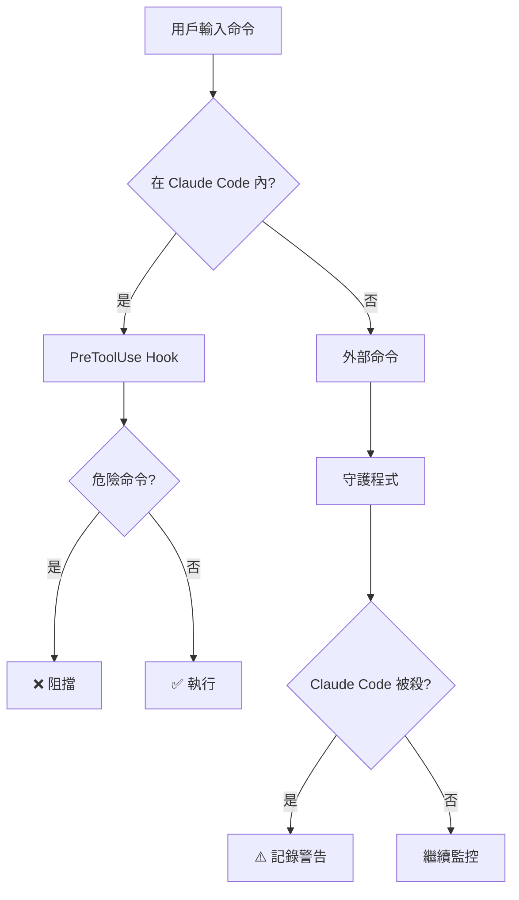

<div align="center">
  <h1>🛡️ SaveClaudeNode</h1>

  **保護你的 Claude Code 會話免於意外終止**

  多層防禦系統，防止誤殺所有 Node.js 進程

  [](https://opensource.org/licenses/MIT)
  [](https://www.rust-lang.org/)
  [](https://www.microsoft.com/windows)
  [](https://github.com/Jeffrey0117/saveclaudenode/stargazers)

  [English](README.md) • [繁體中文](#)

</div>

---

## 🎯 問題背景

曾經不小心用這個命令殺掉**所有** Node.js 進程嗎？

```bash
taskkill /F /IM node.exe  # Windows
pkill node                 # Linux/Mac
```

**💥 實際發生的事：**
- ❌ **Claude Code 被終止** → 整個會話丟失
- ❌ **開發服務器掛掉** → 所有運行中的應用崩潰
- ❌ **背景任務被殺** → 構建進程、監視器、所有東西
- ❌ **工作中斷** → 必須從頭重啟一切

**你只是想殺掉 3000 端口上那個頑固的服務器。** 結果你炸掉了整個 Node.js 生態系統。

### ✨ 解決方案

**SaveClaudeNode** 提供雙層防護：

<table>
<tr>
<td width="50%" align="center">

### 🚫 第一層：預防
**PreToolUse Hook**

在 Claude Code 內部執行前**阻擋**危險命令

**有效性：~95%**

</td>
<td width="50%" align="center">

### 📊 第二層：監控
**守護程式**

監控所有 Node.js 進程並記錄終止事件

**有效性：100% 記錄**

</td>
</tr>
</table>

---

## ✨ 功能特性

<table>
<tr>
<td>

### 🛡️ **智能偵測**
- 自動識別 Claude Code 進程
- 命令行參數模式匹配
- 即時進程監控（500ms 掃描間隔）
- 零誤報

</td>
<td>

### ⚡ **輕量快速**
- 只有 **287KB** 可執行檔
- **< 0.1% CPU** 使用率
- Rust 驅動的性能
- 原生 Windows 整合

</td>
</tr>
<tr>
<td>

### 📝 **完整審計追蹤**
- 記錄所有受保護進程
- 記錄終止事件
- 時間戳 + PID 追蹤
- 完整命令歷史

</td>
<td>

### 🔧 **簡易設置**
- 一鍵 hook 安裝器
- 無需手動配置
- 開箱即用
- 開機自動啟動選項

</td>
</tr>
</table>

---

## 🚀 安裝

### ⚡ 快速安裝（推薦）

**僅安裝 PreToolUse Hook**（阻擋 95% 的意外終止）：

<table>
<tr>
<td width="50%">

**PowerShell:**
```powershell
git clone https://github.com/Jeffrey0117/saveclaudenode.git
cd saveclaudenode
.\install-hook.ps1
```

</td>
<td width="50%">

**命令提示字元:**
```cmd
git clone https://github.com/Jeffrey0117/saveclaudenode.git
cd saveclaudenode
install-hook.bat
```

</td>
</tr>
</table>

**重啟 Claude Code** → ✅ 受到保護！

---

### 🔨 進階安裝（Hook + 守護程式）

完整防護含監控功能：

**1. 安裝 Rust:**
```bash
winget install Rustlang.Rustup
```

**2. 編譯守護程式:**
```bash
git clone https://github.com/Jeffrey0117/saveclaudenode.git
cd saveclaudenode
cargo build --release
```

**3. 安裝 Hook:**
```powershell
.\install-hook.ps1
```

**4. 運行守護程式:**
```bash
# 顯示視窗
.\start-guard.bat

# 背景運行（推薦）
.\start-guard-silent.vbs
```

---

## 📖 使用方法

### 測試 Hook

安裝後，在 Claude Code 中嘗試此命令：

```bash
taskkill /F /IM node.exe
```

**預期輸出：**
```
⛔ 禁止無差別殺 node.exe！這會把 Claude Code 也殺掉！

請使用 /kill <端口號> 來精確殺掉特定端口的進程。
```

✅ **Hook 運作正常！**

### 守護程式輸出

```
════════════════════════════════════════════════
   SaveClaudeNode - Node.js Process Guardian
════════════════════════════════════════════════

[2026-01-28 07:30:15] 🚀 SaveClaudeNode guardian started
[2026-01-28 07:30:15] 📁 Log file: saveclaudenode.log
[2026-01-28 07:30:15] ⏱️  Scan interval: 500ms

守護程式已啟動！
- Monitoring all node.exe and electron.exe processes
- Auto-detecting Claude Code processes
- Log file: saveclaudenode.log

[2026-01-28 07:30:16] 🛡️  Protected Claude Code process: PID 12345
[2026-01-28 07:35:22] ⚠️  ALERT: Protected process PID 12345 was TERMINATED!
```

---

## 🛠️ 運作原理

### 架構圖



### 防護層級

| 層級 | 工具 | 阻擋內容 | 有效性 | 限制 |
|------|------|----------|--------|------|
| **1** | PreToolUse Hook | `taskkill /IM node.exe`<br>`pkill node`<br>`Stop-Process -Name node` | ~95% | 僅在 Claude Code 內有效 |
| **2** | 守護程式 | *僅監控* | 100% 記錄 | 無法阻止終止 |

### 被阻擋的命令模式

Hook 會偵測並阻擋這些模式：

```bash
# Windows
taskkill /F /IM node.exe
taskkill //F //IM node.exe
taskkill /IM electron.exe
wmic process where name="node.exe" delete

# PowerShell
Stop-Process -Name node
Get-Process node | Stop-Process

# Unix 風格（WSL/Git Bash）
pkill node
killall node
kill -9 $(pidof node)
```

---

## 📁 專案結構

```
saveclaudenode/
├── 🦀 src/
│   └── main.rs                  # Rust 守護程式源碼
├── 🪝 hooks/
│   └── block-node-kill.js       # Claude Code PreToolUse hook
├── 📦 target/release/
│   └── saveclaudenode.exe       # 編譯後的執行檔 (287KB)
├── 🔧 install-hook.ps1          # PowerShell hook 安裝器
├── 🔧 install-hook.bat          # 批次檔 hook 安裝器
├── ▶️ start-guard.bat           # 啟動守護程式（顯示視窗）
├── 🔇 start-guard-silent.vbs    # 啟動守護程式（背景）
├── 📖 README.md                 # 英文說明文件
├── 📖 README.zh-TW.md           # 本文件
├── 📖 INSTALL.md                # 詳細安裝指南
└── ⚖️ LICENSE                   # MIT 授權
```

---

## ⚙️ 配置

### 開機自動啟動

**方案 1: 啟動資料夾（最簡單）**
1. 按 `Win + R`
2. 輸入 `shell:startup` → Enter
3. 將 `start-guard-silent.vbs` 複製到開啟的資料夾
4. ✅ 守護程式將在開機時自動啟動

**方案 2: 工作排程器（更多控制）**
```powershell
$action = New-ScheduledTaskAction -Execute "C:\path\to\saveclaudenode.exe"
$trigger = New-ScheduledTaskTrigger -AtLogOn
Register-ScheduledTask -TaskName "SaveClaudeNode" -Action $action -Trigger $trigger -RunLevel Highest
```

---

## 🔍 技術細節

### 守護程式

| 規格 | 數值 |
|------|------|
| **語言** | Rust 🦀 |
| **依賴** | `sysinfo`, `chrono`, `windows-rs` |
| **執行檔大小** | 287KB |
| **CPU 使用率** | < 0.1% |
| **記憶體** | ~2MB |
| **掃描間隔** | 500ms |
| **偵測方法** | 進程差異 + CLI 模式匹配 |

### PreToolUse Hook

| 規格 | 數值 |
|------|------|
| **語言** | JavaScript |
| **Hook 類型** | PreToolUse（執行前） |
| **偵測** | 正則表達式 + 關鍵字分析 |
| **誤報率** | 接近零 |
| **性能影響** | < 1ms 每個命令 |

---

## 🚧 已知限制

### 守護程式

⚠️ **僅監控，無法阻止**

守護程式可以：
- ✅ **偵測** Claude Code 被終止
- ✅ **記錄** 所有終止事件含時間戳
- ✅ **追蹤** 哪些進程被終止

但無法：
- ❌ **阻止** 終止（需要核心驅動）
- ❌ **自動重啟** Claude Code
- ❌ **恢復** 丟失的會話數據

**為什麼？** Windows 安全模型阻止用戶空間應用程式攔截進程終止。只有核心模式驅動程式才能做到。

### 最佳實踐

✅ **同時使用兩層防護：**
- Hook 阻擋 Claude Code 內 95% 的意外終止
- 守護程式提供外部終止的審計追蹤
- 組合防護覆蓋大多數情況

---

## 🗺️ 開發路線圖

### 短期
- [ ] Windows 服務模式（作為系統服務運行）
- [ ] Claude Code 終止時的桌面通知
- [ ] 白名單機制（允許特定 PID）
- [ ] 進程恢復（實驗性自動重啟）

### 長期
- [ ] 核心驅動版本（真正的阻止）
- [ ] Linux/macOS 支援
- [ ] 雲端記錄與分析
- [ ] 多用戶會話支援

**想要某個功能？** [開 issue](https://github.com/Jeffrey0117/saveclaudenode/issues)！

---

## 🤝 貢獻

歡迎貢獻！這個專案源於挫折感。

### 貢獻方式

- 🐛 **回報 bug** - [開 issue](https://github.com/Jeffrey0117/saveclaudenode/issues)
- 💡 **建議功能** - 分享你的想法
- 🔧 **提交 PR** - 修 bug 或加功能
- ⭐ **Star repo** - 幫助其他人發現
- 📢 **分享** - 告訴其他 Claude Code 用戶

### 開發設置

```bash
# Clone repo
git clone https://github.com/Jeffrey0117/saveclaudenode.git
cd saveclaudenode

# 安裝 Rust
winget install Rustlang.Rustup

# 編譯
cargo build --release

# 測試
.\target\release\saveclaudenode.exe
```

---

## 📄 授權

本專案使用 **MIT License** - 詳見 [LICENSE](LICENSE) 檔案。

**簡單說：** 自由使用、修改、散布。只需保留授權聲明。

---

## 🙏 致謝

由被自己誤殺太多次 Claude Code 會話的開發者創建。😅

特別感謝：
- 所有曾經沮喪地輸入 `taskkill /IM node.exe` 的人
- Rust 社群提供的強大系統程式設計工具
- Claude Code 團隊打造了這麼棒的工具值得保護

---

## 📞 支援

- 🐛 **Bug 回報**: [GitHub Issues](https://github.com/Jeffrey0117/saveclaudenode/issues)
- 💬 **問題**: [GitHub Discussions](https://github.com/Jeffrey0117/saveclaudenode/discussions)
- ⭐ **功能請求**: [GitHub Issues](https://github.com/Jeffrey0117/saveclaudenode/issues)

---

<div align="center">

**如果 SaveClaudeNode 救了你的會話，給個 ⭐ 吧！**

Made with 💜 by [Jeffrey0117](https://github.com/Jeffrey0117)

[⬆ 回到頂部](#-saveclaudenode)

</div>
